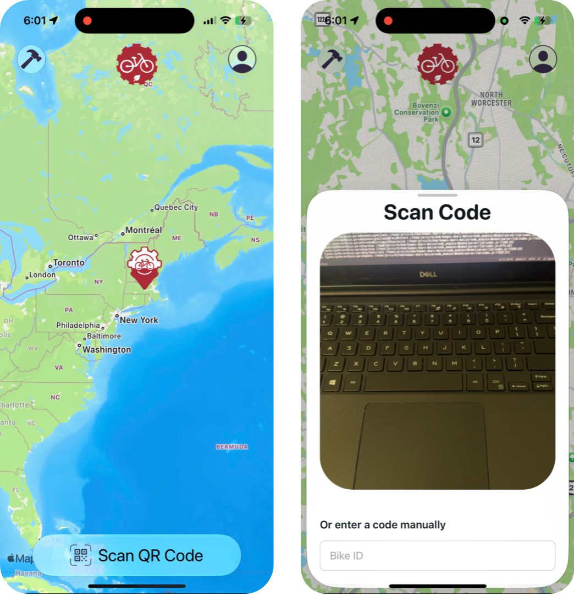

# Gompei's Gears React Native

🚴 The React.js Native App version of the Gompei Gears rental app for the WPI Green Team.  

🐐 Developed by Aiden Cunningham, RBE 2028

### Photos:




## Getting started with development

This is an [Expo](https://expo.dev) project!

1. Install [`npm`](https://www.npmjs.com/) and [`bun`](https://bun.com/) via your preferred method

2. Install dependencies

   ```bash
   npm install
   ```

3. Start the app

   ```bash
   bun start
   ```

This will automatically start the project for [Expo Go](https://expo.dev/go), as well as produce a web bundle.

Download the Expo Go app for [App Store](https://apps.apple.com/us/app/expo-go/id982107779) or [Play Store](https://play.google.com/store/apps/details?id=host.exp.exponent&hl=en_US). You can then scan the QR code provided in the terminal to access a native build of the app

You can start developing by editing the files inside the **app** directory. This project uses [file-based routing](https://docs.expo.dev/router/introduction).

As Expo Go's libraries are quite limited, this project will soon be made into a TestFlight build. For now, we work with Expo Go & the Expo SDK 54

## This Project's Stack

Libraries:
- React.js
- React Native
- Expo Go

<br/>

Routing & Package Management:
- Bun
- npx
- Metro Router
- Supabase PostGreSQL

<br/>

Icons & Media:
- Apple FL Icons

## Learn more

To learn more about developing your project with Expo, look at the following resources:

- [Expo documentation](https://docs.expo.dev/): Learn fundamentals, or go into advanced topics with our [guides](https://docs.expo.dev/guides).
- [Learn Expo tutorial](https://docs.expo.dev/tutorial/introduction/): Follow a step-by-step tutorial where you'll create a project that runs on Android, iOS, and the web.

Other build options:

- [development build](https://docs.expo.dev/develop/development-builds/introduction/)
- [Android emulator](https://docs.expo.dev/workflow/android-studio-emulator/)
- [iOS simulator](https://docs.expo.dev/workflow/ios-simulator/)

## Join the community

Join our community of developers creating universal apps.

- [Expo on GitHub](https://github.com/expo/expo): View our open source platform and contribute.
- [Discord community](https://chat.expo.dev): Chat with Expo users and ask questions.
